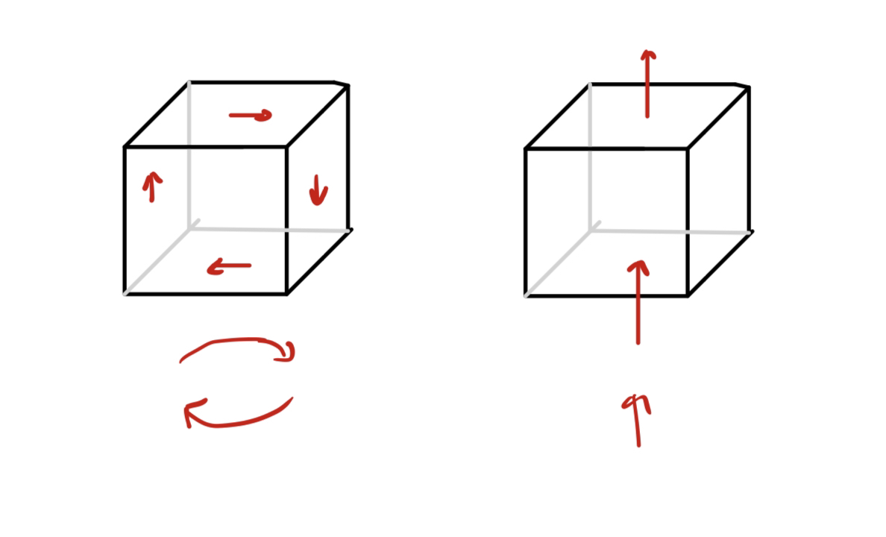
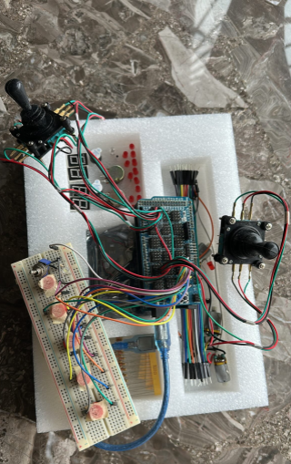
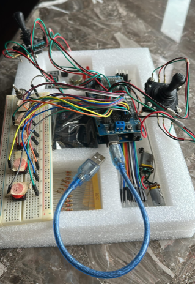
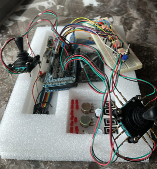
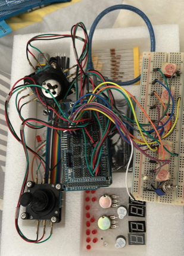

# Reaction Control System (RCS) Simulation

## 1.0 Introduction
This is a Reaction Control System (RCS) simulation I built, inspired by a similar system found in the game *Kerbal Space Program*. The project was completed in prior years, and I am now uploading it to GitHub as a showcase. Unfortunatly a lot of things were lost to time as I did build this a while ago, I had recovered what I could.

The project consists of two phases:
1. **Software Phase**
2. **Hardware Phase**

This simulation models a rigid body controlled by six thrusters positioned around each side of a cube (simulated rigid body). Through various thruster actuations, the system achieves:
- **Rotation** around the three axes.
- **Translation** along the three axes.

## 2.0 Physics
Translational motion and rotational motion can be achieved via actuation shown on the diagram below:

## 3.0 Software
A sample of the simulation script was attached above. Unfortunatly the ardunio code might be lost to time, i am digging around my old mac and will update this if I manage to find it!

## 4.0 Hardware
The hardware section of the project consists of the ardunio controller, which is attached as an image. It is an ardunio mega with a few buttons for testing, and the two joysticks, each used for translation and rotation.

<table>
  <tr>
    <td></td>
    <td></td>
  </tr>
  <tr>
    <td></td>
    <td></td>
  </tr>
</table>
